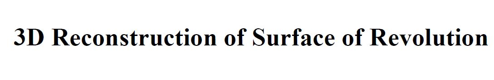
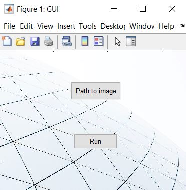
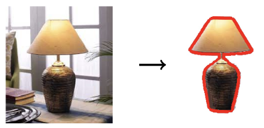
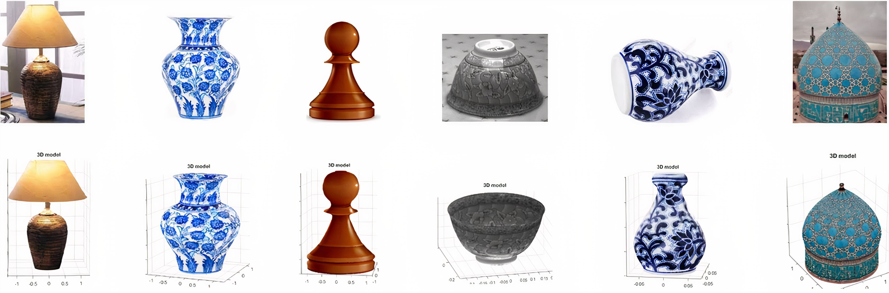

# Single-view 3D Reconstruction of Surface of Revolution
<!-- PROJECT LOGO 
<br />
<p align="center">
    
</p>
-->


<!-- TABLE OF CONTENTS -->
<details open="open">
  <summary>Table of Contents</summary>
  <ol>
    <li><a href="#about-the-project">About The Project</a></li>
    <li><a href="#usage">Usage</a></li>
    <li><a href="#experiments">Experiments</a></li>
    <li><a href="#license">License</a></li>
    <li><a href="#contact">Contact</a></li>
  </ol>
</details>


<!-- ABOUT THE PROJECT -->
## About The Project

3D reconstruction from a single 2D image is a classic problem in computer vision, aiming to recover the shape and structure of an object from its 2D representation. Our project focuses on the reconstruction of the 3D model of a Surface of Revolution (SOR) using a single image. The proposed method tackles an optimization problem to determine the optimal 3D axis of rotational symmetry, aligning the projection of the 3D body with the input 2D image. Additionally, we introduce a novel approach for texture acquisition from a single image of SORs, enhancing the realism of the generated 3D model. Our main contribution is to estimate precise 3D axis of SOR using surface pattern reprojection error.


The main steps to generate the 3D model:
 1. Removing background and detecting the object boundaries in the input image
 2. Computing the plane $\Pi$ that contains the 3D axis $l$
 3. Obtaining the precise 3D axis $l^\ast$
 4. Generating the 3D model
 5. Projecting original image patterns on the 3D body


<!-- USAGE  -->
## Usage

To run the program, you need MATLAB installed and added to 'PATH'. The Python package [rembg](https://github.com/danielgatis/rembg) is also required.
 ```sh
 pip install rembg
 ```
There are two ways to run the reconstruction algorithm:
### GUI
Use the `GUI.m` file:
<p align="center">
    
</p>

### CLI
Run the following command in terminal:
```sh
matlab  -nodesktop -nosplash -r "Path/to/reconstruct_3D(img_dir, [bool point_cloud], [str output_dir]); exit;"
```
- `img_dir`: the path to image of SOR

- `point_cloud`: [optional] whether to save the point cloud or not

- `output_dir`: [optional] the directory to save the outputs (will store results at `$output_dir$/results/`)

Example:
```sh
git clone https://github.com/smh-hosseiny/SOR_3D_Reconstruction.git
cd SOR_3D_Reconstruction/
matlab  -nodesktop -nosplash -r "reconstruct_3D('Path/to/image.jpg'); exit;"
```

## Process Overview:

1. Background Removal:
The initial step involves removing the background from the input image, utilizing a salient object detection [algorithm](https://github.com/danielgatis/rembg).
This process effectively isolates the object in the image, enabling clearer identification of its boundaries.
<p align="center">
    
</p>

3. Automatic 3D Model Reconstruction:
Leveraging the detected outlines and utilizing an optimization approach, the algorithm determines the optimal 3D axis of rotational symmetry.
The calculated 3D axis is then employed to generate the complete 3D model of the object.


<!-- EXPERIMENTS -->
## Experiments

We conducted experiments on various SOR images from Pix3D and BigBIRD datasets and additional SOR images. The results confirm the accuracy of our 3D reconstructed models, demonstrating consistency in terms of shape and surface patterns with the input images.
<p align="center">
    
</p>


<!-- LICENSE -->
## License

Distributed under the MIT License. See `LICENSE` for more information.


<!-- CONTACT -->
## Contact

S.M.H. Hosseini - hosseiny290@gmail.com


