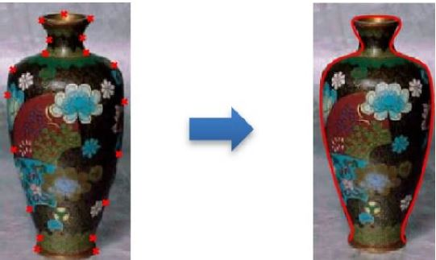
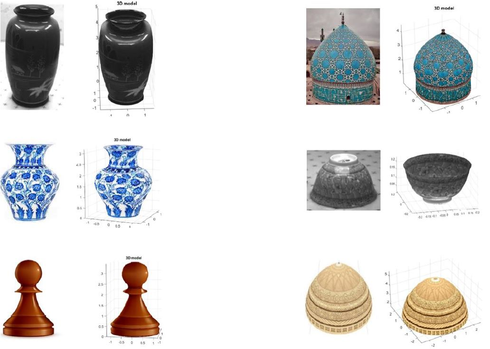

# Single-view 3D Reconstruction of Surface of Revolution
<!-- PROJECT LOGO 
<br />
<p align="center">
    
</p>
-->


<!-- TABLE OF CONTENTS -->
<details open="open">
  <summary>Table of Contents</summary>
  <ol>
    <li><a href="#about-the-project">About The Project</a></li>
    <li><a href="#usage">Usage</a></li>
    <li><a href="#experiments">Experiments</a></li>
    <li><a href="#license">License</a></li>
    <li><a href="#contact">Contact</a></li>
  </ol>
</details>


<!-- ABOUT THE PROJECT -->
## About The Project

3D reconstruction from a single 2D image is a classical problem in computer vision that tries to retrieve the shape and structure of the actual body using its 2D image. We developed a program to reconstruct the 3D model of Surface of Revolution (SOR) using a single image. The proposed method solves an optimization problem to find the best 3D axis of rotational symmetry such that the projection of the 3D body fits the 2D input image. Moreover, we introduce a method for texture acquisition from a single image of SORs to create a more realistic 3D model. We implemented a user-friendly graphical user interface (GUI) in Matlab to facilitate using the program. Our contributions:
* Generating the 3D model of any SOR
* Projecting surface patterns on the 3D model

The main steps to generate the 3D model:
1. Finding borders of the object
2. Fitting tangent ellipses to the original image
3. Computing 3D circles corresponding to the ellipses
4. Solving the optimization problem to find the 3D axis
5. Projecting original image patterns on the generated 3D model


<!-- USAGE  -->
## Usage

The program is implemented in _[Matlab](https://www.mathworks.com/)_, run the program using the command window.
 ```sh
 GUI
 ```
<p align="center">
    
</p>

The user is asked to locate some points on the boundaries of the SOR in order to obtain the borders of the object. Then the algorithm will reconstruct the 3D model automatically.

<p align="center">
    
</p>


<!-- EXPERIMENTS -->
## Experiments

We tested our program on differents SORs and confirmed that the 3D reconstructed models are consistent with the input images.
<p align="center">
    
</p>


<!-- LICENSE -->
## License

Distributed under the MIT License. See `LICENSE` for more information.


<!-- CONTACT -->
## Contact

S.M.H. Hosseiny - [@twitter](https://twitter.com/sotospeakk?s=09) - hosseiny290@gmail.com


