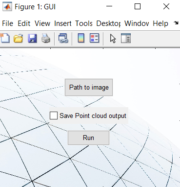

# Single-view 3D Reconstruction of Surface of Revolution
<!-- PROJECT LOGO 
<br />
<p align="center">
    
</p>
-->


<!-- TABLE OF CONTENTS -->
<details open="open">
  <summary>Table of Contents</summary>
  <ol>
    <li><a href="#about-the-project">About The Project</a></li>
    <li><a href="#usage">Usage</a></li>
    <li><a href="#experiments">Experiments</a></li>
    <li><a href="#license">License</a></li>
    <li><a href="#contact">Contact</a></li>
  </ol>
</details>


<!-- ABOUT THE PROJECT -->
## About The Project

3D reconstruction from a single 2D image is a classic problem in computer vision, aiming to recover the shape and structure of an object from its 2D representation. Our project focuses on the reconstruction of the 3D model of a Surface of Revolution (SOR) using a single image. The proposed method tackles an optimization problem to determine the optimal 3D axis of rotational symmetry, aligning the projection of the 3D body with the input 2D image. Additionally, we introduce a novel approach for texture acquisition from a single image of SORs, enhancing the realism of the generated 3D model. Our main contributions:
* Generating the 3D model of any SOR
* Projecting surface patterns on the 3D model

The main steps to generate the 3D model:
1. Detecting the object boundaries in the input image
2. Computing the plane that contains the 3D axis
3. Obtaining the precise 3D axis
4. Generating the 3D model
5. Projecting original image patterns on the 3D body


<!-- USAGE  -->
## Usage

The program is implemented in _[Matlab](https://www.mathworks.com/)_, run the program using the command window.
 ```sh
 GUI
 ```
<p align="center">
    
</p>

Process Overview:

1. Background Removal:
The initial step involves removing the background from the input image, utilizing a salient object detection algorithm, U2-Net \cite{Qin2020U2NetGD}.
This process effectively isolates the object in the image, enabling clearer identification of its boundaries.
2. Automatic 3D Model Reconstruction:
The algorithm proceeds to automatically reconstruct the 3D model of the object.
Leveraging the detected outlines and utilizing an optimization approach, the algorithm determines the optimal 3D axis of rotational symmetry.
The calculated 3D axis is then employed to generate the complete 3D model of the object.

<p align="center">
    
</p>


<!-- EXPERIMENTS -->
## Experiments

We tested our program on differents SORs and confirmed that the 3D reconstructed models are consistent with the input images.
<p align="center">
    
</p>


<!-- LICENSE -->
## License

Distributed under the MIT License. See `LICENSE` for more information.


<!-- CONTACT -->
## Contact

S.M.H. Hosseini - hosseiny290@gmail.com


